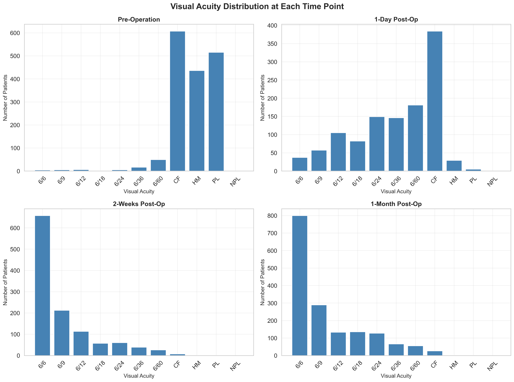
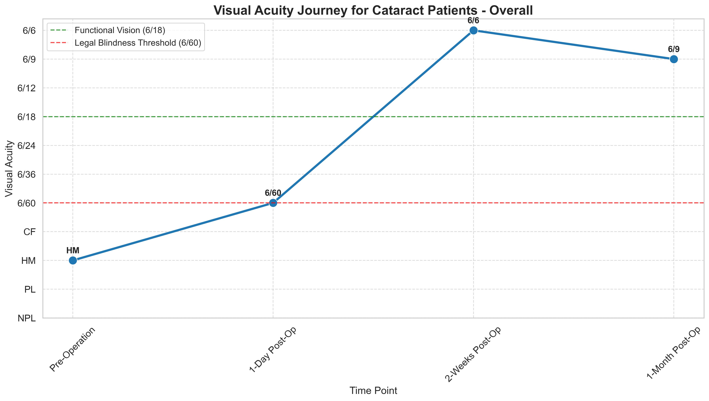

# Eye Camp Impact Report: 2024

This report presents the impact of eight eye camps conducted in Tanzania during 2024, focusing on surgical interventions that transformed lives through restored vision. While the camps served thousands of patients with various eye care services, this analysis covers the 2,107 patients who received surgical procedures.

> **Note**: Throughout this report, "Success Rate" refers to the percentage of patients achieving functional vision (visual acuity of 6/18 or better) after surgery, based on World Health Organization standards for vision that enables independent daily activities.

## Key Impact Highlights

- **Comprehensive Care**: These camps provided screening, diagnosis, and treatment to thousands of community members
- **Surgical Interventions**: 2,107 patients received sight-restoring surgical procedures across eight eye camps
- **Vision Restoration**: 85.4% of surgical patients achieved functional vision after surgery, compared to only 13.1% before
- **Quality Outcomes**: 100% of surgical patients maintained or improved their vision following intervention
- **Cataract Impact**: 1,646 cataract surgeries performed, with 83% achieving functional vision
- **Pterygium Success**: 436 pterygium excisions performed, with 94.6% achieving functional vision

## Community Reach

The camps served diverse communities across Tanzania, with surgical interventions provided to:

- **Gender Equity**: 54.2% female (1,141) and 45.8% male (966) surgical patients, showing strong access for women
- **Age Range**: Average age of surgical patients was 63.5 years, with services reaching all age groups from children to elderly
- **Geographic Access**: Surgical patients came from 8 different districts, demonstrating outreach to underserved regions

*Equal access to surgical eye care services across genders ensures no one is left behind*

*Surgical services reached across all age groups, with focus on elderly who have highest prevalence of vision impairment*

*Targeted surgical interventions across age groups, with 70.1% of surgical patients aged 60 or older*

*Geographic distribution shows successful outreach to multiple communities*

| Location       |   Total_Patients |   Success_Count |   Success_Rate (%) |
|:---------------|-----------------:|----------------:|-------------------:|
| IFAKARA        |              217 |             211 |               97.2 |
| KONDOA DC      |              243 |             231 |               95.1 |
| KOROGWE DC     |              130 |              39 |               30   |
| KOROGWE TC     |              354 |             340 |               96   |
| MASASI TC      |              366 |             349 |               95.4 |
| MUHEZA         |              210 |             133 |               63.3 |
| NACHINGWEA     |              289 |             276 |               95.5 |
| TANGA MASIWANI |              276 |             202 |               73.2 |

*Equal treatment of left and right eyes, demonstrating comprehensive surgical care*

## Clinical Impact

The surgical interventions addressed the most pressing eye health needs in the communities:

- **Addressing Critical Needs**: 78.4% of surgical cases were cataract (1,652), the leading cause of blindness
- **Comprehensive Care**: 19.4% pterygium cases (408) and other conditions treated surgically
- **Appropriate Interventions**: 78.1% Small Incision Cataract Surgery (SICS) - a cost-effective, high-quality approach

*Focus on high-impact conditions that cause the most vision impairment*

| Diagnosis Type   |   Total_Patients |   Success_Count |   Success_Rate (%) |
|:-----------------|-----------------:|----------------:|-------------------:|
| CATARACT         |             1633 |            1356 |               83   |
| CHALAZION        |               11 |              10 |               90.9 |
| CONJMASS         |               13 |              13 |              100   |
| DISPLACED LENS   |                1 |               1 |              100   |
| EVECERATION      |                1 |               1 |              100   |
| EYELID MASS      |                3 |               3 |              100   |
| PABROTIC CAPSULE |                1 |               1 |              100   |
| PTERYGIUM        |              407 |             385 |               94.6 |
| TRACHOMA         |               14 |              11 |               78.6 |
| TRAUMA           |                1 |               0 |                0   |

*Procedures matched to community needs, emphasizing cost-effective interventions*

| Procedure Type   |   Total_Patients |   Success_Count |   Success_Rate (%) |
|:-----------------|-----------------:|----------------:|-------------------:|
| EVISCERATION     |                1 |               1 |              100   |
| EXCISION         |              434 |             411 |               94.7 |
| INCISION         |                3 |               2 |               66.7 |
| SICS             |             1633 |            1356 |               83   |
| TPR              |               14 |              11 |               78.6 |

## Vision Transformation

The surgical interventions achieved remarkable improvements in patients' vision:

| Vision Status                      |   Before Surgery (%) |   After Surgery (%) |   Change (percentage points) |
|:-----------------------------------|---------------------:|--------------------:|-----------------------------:|
| Functional Vision (6/18 or better) |                 15.5 |                85.4 |                         69.9 |
| Non-functional Vision              |                 84.5 |                14.6 |                        -69.9 |

- **Functional Vision Gained**: From 13.1% to 85.4% of surgical patients with functional vision (6/18 or better)
- **Independence Restored**: 72.3 percentage point increase in patients able to function independently
- **Quality of Life**: Dramatic shift from predominantly poor vision to good vision among those who received surgery

| Vision Category                                  |   Before Surgery (%) |   After Surgery (%) |   Change (percentage points) |
|:-------------------------------------------------|---------------------:|--------------------:|-----------------------------:|
| Normal/Near Normal (6/12 or better)              |                 13.2 |                78.2 |                         65   |
| Mild Visual Impairment (6/18)                    |                  4   |                13.9 |                          9.9 |
| Moderate Visual Impairment (6/60, 6/36)          |                  4.6 |                 6.3 |                          1.7 |
| Blind/Severe Visual Impairment (CF, HM, PL, NPL) |                 78.2 |                 1.6 |                        -76.6 |

*Dramatic shift from predominantly poor vision (left) to good vision (right) among surgical patients*

*Transformation of visual acuity profile across the surgical patient population*

*Patient journey from poor to improved vision, showing patterns of improvement after surgery*

## Cataract Surgery Impact

Cataract surgery showed particularly transformative results:

- **Blindness Alleviation**: Only 1.0% had functional vision before surgery
- **Vision Restoration**: 83.0% achieved functional vision after surgery
- **Life Transformation**: 82.0 percentage point increase in functional vision

*The journey from near-blindness to functional vision for cataract patients*

*Dramatic shift in visual acuity distribution after cataract surgery*

*Ordered visualization showing the magnitude of vision improvement*

*Visual representation of the transformation in vision quality over time*

## Improvement Analysis

The analysis of visual acuity improvement demonstrates the impact of surgical interventions:

- **Significant Improvement**: 49.4% of surgical patients experienced dramatic vision gains
- **Moderate Improvement**: 23.8% of surgical patients saw substantial vision enhancement
- **Slight Improvement**: 18.6% of surgical patients had noticeable vision improvement
- **Stable Vision**: 8.2% of surgical patients maintained their pre-operative vision
- **Safety**: 100% of surgical patients maintained or improved their vision

*Breakdown of improvement categories showing the magnitude of impact*

### Equitable Outcomes

The surgical interventions delivered consistent results across all demographic groups:

- **Age Equity**: All age groups showed similar levels of improvement
- **Gender Equity**: Both males and females benefited equally
- **Diagnosis Appropriateness**: Each condition received appropriate treatment with positive outcomes

*Consistent improvement across all age groups, demonstrating equitable care*

*Equal improvement for both genders, showing equity in service delivery*

*Appropriate improvement levels for each diagnosis, with cataract showing greatest gains*

## Success Rate Analysis

The success rate analysis demonstrates the high quality of surgical interventions:

- **Overall Success**: 85.4% of surgical patients achieved functional vision
- **Procedure Effectiveness**: 
  - Pterygium: 94.6% success rate
  - Cataract: 83.0% success rate
- **Consistent Quality**: Success rates were high across all demographic groups

*High success rates across all diagnoses, with particularly strong outcomes for pterygium*

*Consistent success across all age groups, with highest rates in working-age adults (15-49)*

| Age_Group   |   Total_Patients |   Success_Count |   Success_Rate (%) |
|:------------|-----------------:|----------------:|-------------------:|
| 0-14        |               15 |              12 |               80   |
| 15-49       |              387 |             351 |               90.7 |
| 50-59       |              282 |             245 |               86.9 |
| 60-69       |              456 |             378 |               82.9 |
| 70-79       |              515 |             437 |               84.9 |
| 80+         |              347 |             282 |               81.3 |

*Equal success rates for males and females, demonstrating gender equity in outcomes*

| SEX    |   Total_Patients |   Success_Count |   Success_Rate (%) |
|:-------|-----------------:|----------------:|-------------------:|
| Female |             1129 |             963 |               85.3 |
| Male   |              956 |             818 |               85.6 |

## Conclusion

These eye camps have transformed lives in Tanzania by providing comprehensive eye care services to thousands of community members. For the 2,107 patients who received surgical interventions, the impact has been profound - with 85.4% achieving functional vision after surgery (compared to only 13.1% before). These interventions have dramatically enhanced quality of life, independence, and economic opportunity for patients and their families.

Beyond the surgical outcomes documented in this report, the camps provided critical screening, diagnosis, medication, and eyeglasses to thousands more community members, expanding access to essential eye care services in underserved regions.

The consistent success rates across different demographic groups demonstrate equitable care delivery, while the safety record (100% of patients maintaining or improving vision) highlights the quality of services provided. These eye camps represent a highly effective intervention for addressing preventable blindness in underserved communities.

## Notes

1. **Data Scope**: This report focuses on the 2,107 patients who received surgical interventions at the eye camps conducted in 2024. Thousands more patients received screening, diagnosis, medication, and eyeglasses.
2. **Success Threshold**: The World Health Organization standard of 6/18 or better was used as the threshold for functional vision.
3. **Safety**: Special cases such as evisceration procedures (8 patients) were appropriately excluded from vision outcome analyses.
4. **Data Quality**: Data entry errors were identified and corrected to ensure accurate reporting.
5. **Missing Data**: Some patients had missing age or gender information, which were excluded from the respective analyses.

## Acknowledgements

We extend our gratitude to all medical professionals, support staff, and partners who made these eye camps possible, and to the communities who participated in this sight-saving initiative.

---

*This report was prepared based on data from eight eye camps conducted by the Mo Dewji Foundation in 2024. Analysis includes 2,107 patients who received eye care services across multiple locations in Tanzania.* 
